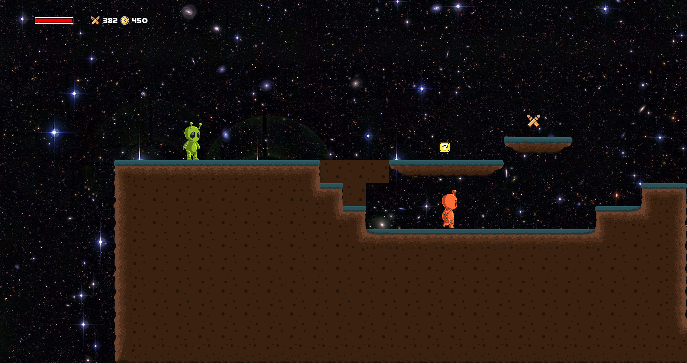

## Alienator

Alienator is an exciting 2D platformer where you take on the role of an alien hero. Your mission is to overcome enemies, gather power-ups, and unlock achievements. Beware of enemies with unique attack patterns!

### Controls
- `A` and `LEFT ARROW` -> Move left
- `D` and `RIGHT ARROW` -> Move right
- `W`, `UP ARROW`, and `SPACE` -> Jump
- `Left Click` -> Shoot
- `R` -> Reload
- `ESC` -> Pause
- Navigate menus with `ARROW KEYS` and `ENTER`

### Achievements
- **Defeat 10 Enemies**: Prove your combat skills.
- **Jump 20 Times**: Show off your agility.
- **Shoot 100 Bullets**: Unleash your firepower.
- **Die 10 Times**: Learn from your mistakes.
- **Fall 5 Times**: Watch your step!

*Main Menu*

*Gameplay Screen*

Jump into the action and help our alien hero conquer the challenges ahead!

## Contributing

Contributions are welcome. Please feel free to submit pull requests for improvements or new features.

## License

MIT License
